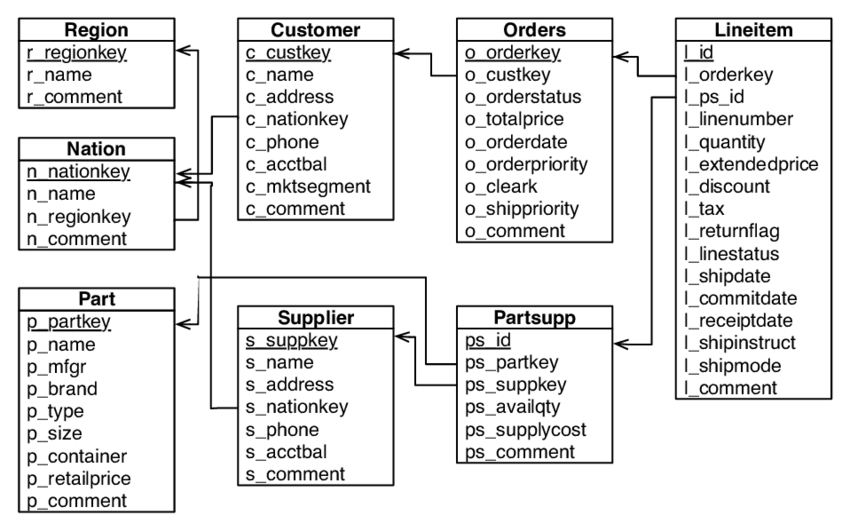

# The Factory Project
In this factory demo project our data team got to a point when users analytics operations like basic ad-hoc queries
and reporting are getting hard to build and maintain.
 
We would like to refactoring our factory data project by design new DWH schema by denormalize the data
into a star like schema and provide ETL solution that migrated the data files to the suggested solution. 
 
### Tools and Technologies
We are using Python and SQL (open-source solutions are welcome as long as we can easily run the provided solution). 

### What we need from you?
Clone this repo, build your ETL process and open a Pull request with your details.

### General guidelines
* Your solution should enable users to easily slice and dice the data through a report, or using basic ad-hoc queries.
* Include a step-by-step instruction to run your code.
* We may move or delete your code after we have analysed the PR. 
* Time spent between 4-6 hours.

### Source files
* Data for this exercise can be found in the `data.zip` file.
* Schema for this exercise can be found in the `schema.sql` file.

TODO
--------- 

1.Design a star schema model, and write the load scripts to populate the schema. Provide the loads scripts, alongside an ERD. 

- define a classification for breaking the customer account balances into 3 logical groups
- add a field for this new classification
- add revenue per line item

-----

2.Describe how you can schedule this process to run multiple times per day.
 
- What would you do to cater for data arriving in random order?
- What about if the data comes from a stream, and arrives at random times?

-----

3.Describe how you would deploy your code to production, and allow for future maintenance.

- What changes would you need to make to run this code in a containerized environment (e.g. Docker)? 

-----

4.Write SQL queries to answer the following questions:

   a. What are the top 5 nations in terms of revenue?
 
   b. From the top 5 nations, what is the most common shipping mode?

   c. What are the top 3 selling months?

   d. Who are the top customer(s) in terms of either revenue or quantity?

   e. Compare the sales revenue on a financial year-to-year (01 July to 30 June) basis.

   f. What other insights can be generated from this dataset?

-----

5.If this pipeline is to be build for a real live environment.
What would be your recommendations in terms of tools and process?

-----

Current ERD
--

